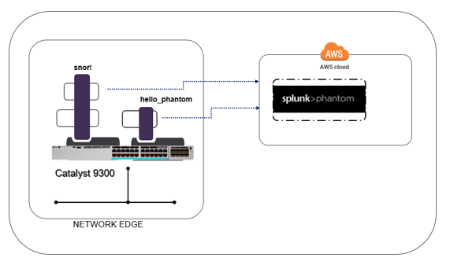

cat9k-soar
----------
Application Hosting on the Catalyst 9K, an interface to Splunk Phantom security orchestration, automation and response (SOAR)

This project uses the application hosting feature of the Catalyst 9K as a distributed platform for gathering and pushing security data to Phantom. This data can be combined with other enrichment sources, and as a trigger for automating incident response.

### Technology Value

Application hosting at the network edge, on the Cisco Catalyst 9300 series switches, enables the network manager to deploy applications on an x86 CPU for the purpose of analyzing and gathering telemetry about traffic on the network. Container based applications can be developed and tested using Docker on Linux systems, then deployed on the Catalyst 9300 series switches, providing the network and security operations a distributed cyber security interface to the enterprise security orchestration, automation and response (SOAR) platform.

The `cat9k-soar` project is a sample code base for ingesting data collected at the network edge as security incidents, managed and acted upon by Splunk Phantom.

### Components

**SOAR**: The acronym SOAR, Security Orchestration, Automation and Response is a process and concept of managing contextual data associated with cyber attacks and security related incidents. The SOAR platform **Splunk Phantom** fundamental to this solution. World Wide Technolgy has developed both apps and data ingest [software](https://github.com/joelwking/Phantom-Cyber) for the **Splunk Phantom** platform, which is leveraged in this solution.

**Linux Containers**: specifically Docker, building software solutions using Docker containerization shortens development cycles and decreases the barriers to deploying apps on the target systems. In this solution, applications are developed and packaged on Linux systems and then installed on the network edge running on Catalyst 9300 series switches.

**Application Hosting**: The Cisco Catalyst 9300 series switches now supports application hosting using reserved memory and CPU, running as a separate Linux process, isolated from the IOS XE operating system. This solution is beneficial to the network manager as it does not require separate computing machines to run the software on the network edge. 

**Catalyst 9K SOAR**: The Python software contained in this solution includes foundational code to create security events (Phantom *containers*) and security data (Phantom *artifacts*) on the Splunk Phantom platform. Within the `library` directory, there are two sub-directories, `hello_phantom` and `snort`. 

#### Topology Diagram

#### Software

The file `library/connector/base_connector.py` contains a Python class *SOAR*, which is imported and referenced as a Python superclass by the `library/hello_phantom/hello.py` and `library/snort/snort.py`.  The `base_connector.py` imports [https://github.com/joelwking/Phantom-Cyber/blob/master/REST_ingest/PhantomIngest.py](https://github.com/joelwking/Phantom-Cyber/blob/master/REST_ingest/PhantomIngest.py) which uses the Python `requests` module to address the Phantom REST APIs. 

##### hello_phantom

This Docker app is a basic 'hello world' example which creates an event (container) in Phantom.

##### snort

This Docker app installs, configures and executes Snort. [Snort](https://www.snort.org) is an open-source, free and lightweight network intrusion detection system (NIDS). The Snort configuration file enables alerts to be written to a CSV file. Alerts written to the file are processed by `snort.py` and used to create events (containers) and artifacts in CEF (Common Exchange Format) format. The shell `snort.sh` starts both Snort and the Python program.

### Status

Alpha 1.0 - The base functionality of the software has been tested and Phantom containers and artifacts can be created by the software running in Docker containers in a Linux host, to a Phantom community instance (version 4.5.15922) deployed in Amazon Web Services (AWS). Additional testing scheduled for the [DevNet Sandbox](https://developer.cisco.com/site/sandbox/) as reservations become available mid-September 2019. 

## Installation

Information on installing and configuring Splunk Phantom is available by joining the Phantom Community or through training.

* Phantom Community https://my.phantom.us/
* Administering Phantom https://www.splunk.com/en_us/training/courses/introduction-to-phantom.html

At a minimum, the REST Data Source app will need to be enabled and configured on the Phantom instance. This app is a custom REST handler to allow push/ ingest data such as events and artifacts into Phantom.

Build instructions for each app in the `library` directory are included the `README.md` file.

Instructions for deploying the app(s) are available on DevNet as [Application Hosting in the Enterprise](https://developer.cisco.com/docs/app-hosting)

## Configuration

The `base_connector` class SOAR attempts to load a configuration file, by default, using the program name and '.yml' or by a YAML file specified as the first argument to the program. Sample configuration and credential inputs are read from the YAML file in the respective directories, for example, `library/hello_phantom/hello.yml` specifies the IP address and API key for the Phantom instance.

Optionally, variables can be specified and are imported. For example, `snort_constants.py` specifies an interval to wait for new input to arrive in the alert file.

Refer to the README specified for each app for additional information on configuring the app.

## Usage

Show users how to use the code. Be specific.
Use appropriate formatting when showing code snippets or command line output.
If a particular [DevNet Sandbox](https://developer.cisco.com/sandbox/) or [Learning Lab](https://developer.cisco.com/learning-labs/) can be used in to provide a network or other resources to be used with this code, call that out here. 

## Known issues

Use the the [Issue Tracker](./issues), to open a new issue or provide feedback. 

* The DevNet Sandbox restricts access to the Internet from the sandbox labs, limiting access to an instance of Phantom deployed in AWS/cloud or the Internet.
* Note the [restrictions](https://developer.cisco.com/docs/app-hosting/#!getting-cat9k-setup) on Catalyst hardware and software.
* The app-hosting service utilizes meta data that will be present only when the Docker save command uses the  *image_name:tag* format. 

## Getting help

If you have questions, concerns, bug reports, etc., please file an issue in this repository's [Issue Tracker](./issues).

## Getting involved

This section should detail why people should get involved and describe key areas you are currently focusing on; e.g., trying to get feedback on features, fixing certain bugs, building important pieces, etc. Include information on how to setup a development environment if different from general installation instructions.

General instructions on _how_ to contribute should be stated with a link to [CONTRIBUTING](./CONTRIBUTING.md).

## Credits and references

1. Projects that inspired you
2. Related projects
3. Books, papers, talks, or other sources that have meaningful impact or influence on this code
