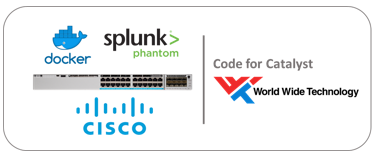

cat9k-soar
----------
Application Hosting on the Catalyst 9K, an interface to Splunk Phantom security orchestration, automation and response (SOAR)

This project uses the application hosting feature of the Catalyst 9K as a distributed platform for gathering and pushing security data to Phantom. This data can be combined with other enrichment sources, and as a trigger for automating incident response.

### Technology Value

Application hosting at the network edge, on the Cisco Catalyst 9300 series switches, enables the network manager to deploy applications on an x86 CPU for the purpose of analyzing and gathering telemetry about traffic on the network. Container based applications can be developed and tested using Docker on Linux systems, then deployed on the Catalyst 9300 series switches, providing the network and security operations a distributed cyber security interface to the enterprise security orchestration, automation and response (SOAR) platform.

The `cat9k-soar` project is a sample code base for ingesting data collected at the network edge as security incidents, managed and acted upon by Splunk Phantom.

### Components

**SOAR**: The acronym SOAR, Security Orchestration, Automation and Response is a process and concept of managing contextual data associated with cyber attacks and security related incidents. The SOAR platform **Splunk Phantom** fundamental to this solution. World Wide Technolgy has developed both apps and data ingest [software](https://github.com/joelwking/Phantom-Cyber) for the **Splunk Phantom** platform, which is leveraged in this solution.

**Linux Containers**: specifically Docker, building software solutions using Docker containerization shortens development cycles and decreases the barriers to deploying apps on the target systems. In this solution, applications are developed and packaged on Linux systems and then installed on the network edge running on Catalyst 9300 series switches.

**Application Hosting**: The Cisco Catalyst 9300 series switches now supports application hosting using reserved memory and CPU, running as a separate Linux process, isolated from the IOS XE operating system. This solution is beneficial to the network manager as it does not require separate computing machines to run the software on the network edge. 

**Catalyst 9K SOAR**: The Python software contained in this solution includes foundational code to create security events (Phantom *containers*) and security data (Phantom *artifacts*) on the Splunk Phantom platform. Within the `library` directory, there are two sub-directories, `hello_phantom` and `snort`. 

#### Software

The file `library/connector/base_connector.py` contains a Python class *SOAR*, which is imported and referenced as a Python superclass by the `library/hello_phantom/hello.py` and `library/snort/snort.py`.  The `base_connector.py` imports [https://github.com/joelwking/Phantom-Cyber/blob/master/REST_ingest/PhantomIngest.py](https://github.com/joelwking/Phantom-Cyber/blob/master/REST_ingest/PhantomIngest.py) which uses the Python `requests` module to address the Phantom REST APIs. 

Sample configuration and credential inputs are read from the YAML file in the respective directories, for example, `library/hello_phantom/hello.yml` specifies the IP address and API key for the Phantom instance.

##### hello_phantom

This Docker app is a basic 'hello world' example which creates an event (container) in Phantom.

##### snort

This Docker app installs, configures and executes Snort. [Snort](https://www.snort.org) is an open-source, free and lightweight network intrusion detection system (NIDS). The Snort configuration file enables alerts to be written to a CSV file. Alerts written to the file are processed by `snort.py` and used to create events (containers) and artifacts in CEF (Common Exchange Format) format.

#### Topology Diagram

### Status

Alpha 1.0 - The base functionality of the software has been tested and Phantom containers and artifacts can be created by the software running in Docker containers in a Linux host, to a Phantom community instance (version 4.5.15922) deployed in Amazon Web Services (AWS). Additional testing scheduled for the [DevNet Sandbox](https://developer.cisco.com/site/sandbox/) as reservations become available mid-September 2019. 

## Installation

Information on installing and configuring Splunk Phantom is available by joining the Phantom Community or through training.

* Phantom Community https://my.phantom.us/
* Administering Phantom https://www.splunk.com/en_us/training/courses/introduction-to-phantom.html

At a minimum, the REST Data Source app will need to be enabled and configured on the Phantom instance. This app is a custom REST handler to push ingest data such as events and artifacts into Phantom.

Detailed instructions on how to install, configure, and get the project running. Call out any dependencies. This should be frequently tested and updated to make sure it works reliably, accounts for updated versions of dependencies, etc.

## Configuration

If the code is configurable, describe it in detail, either here or in other documentation that you reference.

## Usage

Show users how to use the code. Be specific.
Use appropriate formatting when showing code snippets or command line output.
If a particular [DevNet Sandbox](https://developer.cisco.com/sandbox/) or [Learning Lab](https://developer.cisco.com/learning-labs/) can be used in to provide a network or other resources to be used with this code, call that out here. 

## How to test the software

Provide details on steps to test, versions of components/depencencies against which code was tested, date the code was last tested, etc. 
If the repo includes automated tests, detail how to run those tests.
If the repo is instrumented with a continuous testing framework, that is even better.

## Known issues

Document any known significant shortcomings with the code. If using the [Issue Tracker](./issues), make that known here and provide any templates or conventions to be followed when opening a new issue. 

## Getting help

If you have questions, concerns, bug reports, etc., please file an issue in this repository's [Issue Tracker](./issues).

## Getting involved

This section should detail why people should get involved and describe key areas you are currently focusing on; e.g., trying to get feedback on features, fixing certain bugs, building important pieces, etc. Include information on how to setup a development environment if different from general installation instructions.

General instructions on _how_ to contribute should be stated with a link to [CONTRIBUTING](./CONTRIBUTING.md).

## Credits and references

1. Projects that inspired you
2. Related projects
3. Books, papers, talks, or other sources that have meaningful impact or influence on this code

#===========================================================================
#===========================================================================

trigger Phantom into action, such as incidents, threat indicators, vulnerabilities, emails, and more. Phantom gives you full access to the contents of your security data for the purposes of automated decision making.
Splunk Phantom Security Orchestration

Splunk Phantom: 

  Security Operations and Incident Response consists of processes, resources and solutions that prevent, detect and respond to cyber attacks and privacy/security incidents, including security analytics, incident response, and applicable threat intelligence.

Pro tips: 

* Code Exchange displays the first few content lines of your README in the tile it creates for your repo. If you enter a GitHub Description, Code Exchange uses that instead. 
* Code Exchange works best with READMEs formatted in [GitHub's flavor of Markdown](https://guides.github.com/features/mastering-markdown/). Support for reStructuredText is a work in progress.

Other things you might include:

* Technology stack: Indicate the technological nature of the code, including primary programming language(s) and whether the code is intended as standalone or as a module in a framework or other ecosystem.
* Status:  Alpha, Beta, 1.1, etc. It's OK to write a sentence, too. The goal is to let interested people know where what they can expect from this code.
* Screenshot: If the code has visual components, place a screenshot after the description; e.g.,

